# Lost in Library - Steam Games

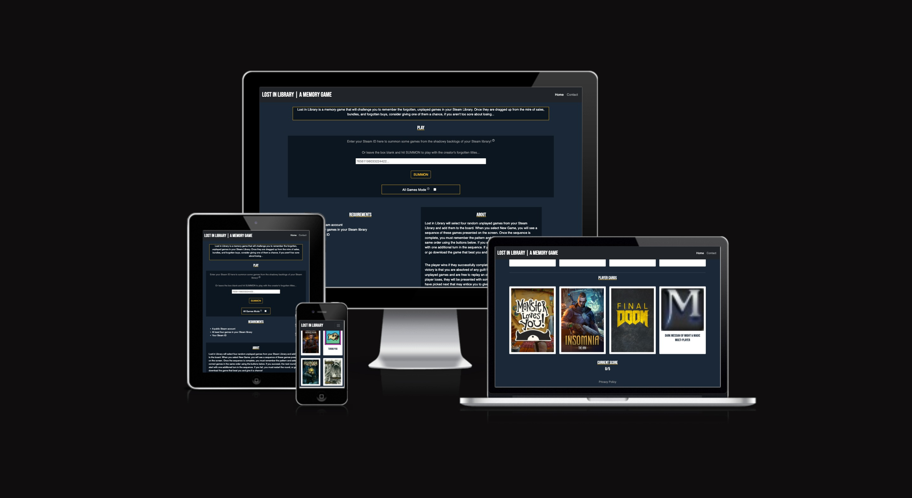

Developed by Benedict Amory Chambers
## Table of Contents

1. [Project Goals](#project-goals)
    1. [User Goals](#user-goals)
    2. [Site Goals](#site-goals)
2. [User Experience](#user-experience)
    1. [Target Audience](#target-audience)
    2. [User Stories](#user-stories)
3. [Design](#design)
    1. [Design Choices](#design-choices)
    2. [Colours](#colours)
    3. [Fonts](#fonts)
    4. [Structure](#structure)
    5. [Wireframes](#wireframes)
4. [Technologies](#technologies)
    1. [Languages](#languages)
    2. [Frameworks and Tools](#frameworks-and-tools)
5. [Features](#features)
6. [Testing](#testing)
    1. [HTML Validation](#HTML-validation)
    2. [CSS Validation](#CSS-validation)
    3. [JavaScript Validation](#javascript-validation)
    4. [Accessibility](#accessibility)
    5. [Performance](#performance)
    6. [Compatibility](#compatibility)
    7. [Testing user stories](#testing-user-stories)
7. [Bugs](#bugs)
8. [Credits](#credits)
9. [Deployment](#deployment)
10. [Acknowledgements](#acknowledgements)

## Project Goals

This is a memory game that challenges the player to remember a sequence of ten games that are briefly shown on screen before they are prompted to enter the same sequence again. The game makes use of an API provided by the gaming platform and distributor, Steam, to access a user's public profile data and generate the sequence using only games they own, which adds a layer of familiarity to the challenge. The website aims to be engaging by focusing on interactivity, user feedback, and a personalised experience. It is intended to be a fun, accessible experience showcasing interactivity between a user and a website.

### User Goals

- A clear and concise understanding of the game experience the website offers
- A visually clean and uncluttered presentation that focuses the user's attention on the parts of the page they can interact with to personalise or engage with the game
- The site accounts for all interactive elements of the user's experiences, particularly when there is an error or incompatibility with user input

### Site Goals

- Uses interactivity to focus and hold a user's attention
- Offers a personalised and thus more memorable experience
- Connects with the user demographic and communicates the experience offered in a fitting and appropriate way

### Developer Goals

- The website looks good and functions properly in all interactive and non-interactive elements on a range of devices
- The game functions well on all devices and is clear and consistent to play
- The site is accessible to a wide range of users and is easy to navigate
- Offer a personalised experience and communicate clearly to the user how they can interact with the application

## User Experience

### Target Audience

- Steam users and games enthusiasts
- Any user that wants to play a simple memory game

### User Stories 

#### First-time User
As a first-time user, I want to:

1. Understand what the site is offering and why at first glance
2. Grasp the rules of the game before starting to play
3. Be able to easily decide what parameters of the game I want to change
4. Still be able to play the game if I am not a Steam user or am not seeking a personalised game experience
5. Know how the game works and how it is processing my personal data
6. Play on whatever device I am using
7. Easily contact the creator of the site if I have questions or feedback
8. Navigate around the site with ease and clarity

#### Returning User
As a returning user, I want to:

9. Start the game quickly, as I already understand the rules
10. Start a new game when the first game is finished
11. Choose how I want to play the game 
12. Have a new experience each time I play
13. Be surprised by games in my game library that I haven't played
14. Be able to easily check out one of those games at the end of the memory game

#### Site Owner
As the site owner, I want to:

15. Create an accessible and responsive website that works well and looks good on a wide range of devices
16. Design a fun, simple memory game
17. Tailor the game and website experience to the target demographic
18. Encourage users to have fun, and to explore their unplayed games
19. Aim for as simple an experience as possible and be direct about how the game accesses and uses personal data

## Design

### Design Choices

I've aimed to create as simple and clear a design as I can, in order to make the important information and interactive elements as clear as possible, to focus on the visuals of user feedback, and to not distract from the game. Additionally, I have themed the game around recognisable Steam design principles, in order to create a cohesive and intuitive experience.

### Colours

I have used a colour scheme that evokes the theming and usage of Steam as a platform, both being familiar background colours for Steam community pages. Additionally, I used some bright and complementary colours for the gameboard page; I chose a bright green colour both to indicate when a player has made a selection by highlighting the background of the image and to evoke success upon correct input; I chose a contrasting pink colour to draw the user's attention more to the next game being displayed in the sequence; I used a complementary red colour to indicate an incorrect input.

Main theme colour: #1b2838

Darker theme colour for contrast: #0c1620

### Fonts

I chose two fonts to use on the website; one for bold, attention grabbing headings, and one for clear, accessible, simple communicative text. Both fonts are sans-serif as I wanted them to look cohesive and easy-to-read; both were selected to fit in with the minimalistic aesthetic.

[Bebas Neue](https://fonts.google.com/specimen/Bebas+Neue) - Headings

[Roboto](https://fonts.google.com/specimen/Roboto) - Plain text

### Structure 

The site consists of three pages and a unique 404 error page. These are navigated between using a navbar at the top of the screen, and a link to the Privacy Policy in the footer of all pages.

1. Homepage - This is the landing page for the user. It explains what the site offers, the rules of the game, and the parameters that can be chosen by the user. It contains several points of user input, an information section that gives a full breakdown of necessary info, and a button that takes the player to a new game. This transition takes place on the homepage, even though it clears the previous content and displays a gameboard. 

2. Contact - This is a contact form allowing the user to get in touch with the site owner, which is then emailed directly to the owner's inbox using EmailJS.

3. Privacy policy - A page detailing the terms of use of the application, how it accesses and uses personal data, and declaring the site's relationship to Valve and to Steam

### Wireframes

Wireframes created in Balsamiq 

Homepage

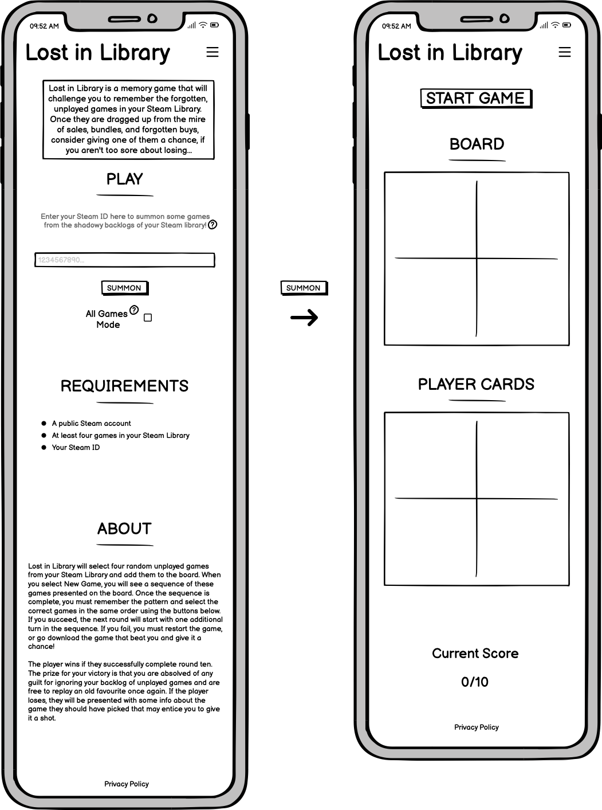
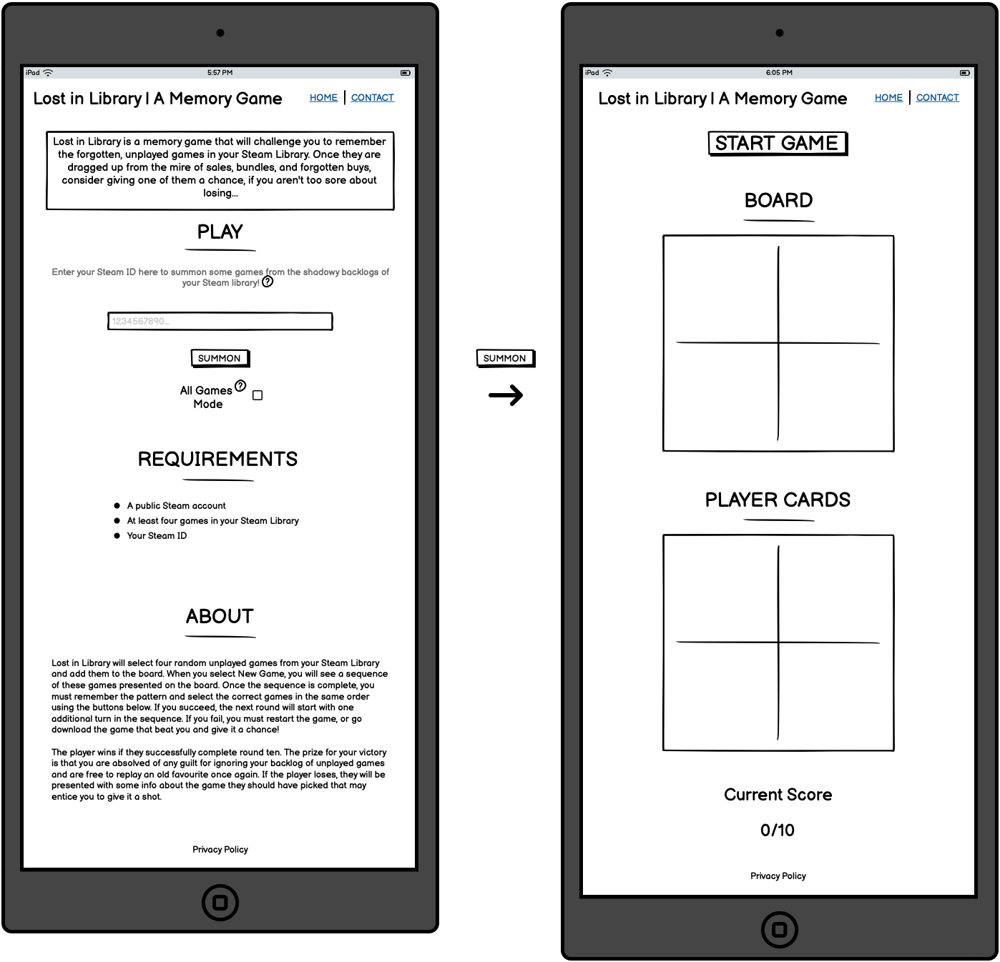
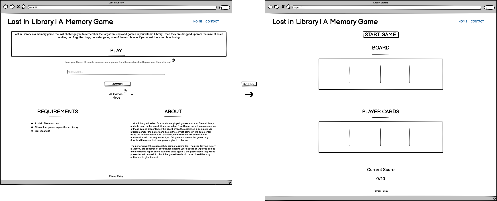

## Technologies 

### Languages

HTML5

CSS3

JavaScript

### Frameworks and Tools

[Node.js](https://nodejs.org/en)

I used Node.js in developing this project for two reasons; firstly, I wanted to use Test Driven Development when developing the setup.js file which makes a call to the Steam Web API and populates the game with all the necessary data and content for a personalised experience. Secondly, as I discovered during development, the Steam Web API does not accept client-side calls, and so both during development and in deployment I used Node.js with the Express.js web framework to create a small simple server from which to make API calls. 

[Express.js](https://expressjs.com/)

I used Express.js to make server-side calls to the Steam Web API

[Jest](https://jestjs.io/)

I used Jest as a testing suite when developing the above-mentioned data resourcing elements of the game

[jQuery](https://jquery.com/)

During development I decided to include the jQuery library to standardise the animations and transitions between different elements of the game. This was largely for the usage of the fadeIn and fadeOut methods which create a consistent transition animation, as opposed to using different CSS transition properties for each element that changes during the game. Additionally, I then used other jQuery methods in looping over arrays of elements that required simple animations and to create cleaner, shorter, more efficient code for some of the user interactions with the game cards.

[Bootstrap v5.3](https://getbootstrap.com/docs/5.3/getting-started/introduction/)

[Visual Studio Code](https://code.visualstudio.com/)

[Git](github.com)

[Heroku](heroku.com)

[Google Fonts](https://fonts.google.com/)

[Balsamiq](https://balsamiq.com/)

[Obsidian](https://obsidian.md/)

[Font Awesome](https://fontawesome.com/)

[Favicon](https://favicon.io/)

[W3C Markup Validation Service](https://validator.w3.org/)

[W3C CSS Validation Service](https://jigsaw.w3.org/css-validator/)

[WebAIM Contrast Checker](https://webaim.org/resources/contrastchecker/)

[WAVE Web Accessibility Evaluation Tools](https://wave.webaim.org/)

[Am I Responsive?](https://ui.dev/amiresponsive)

## Features

### Header and Navigation

- The navigation bar is present at the top of every page to allow intuitive and easy navigation between the two main pages
- The stylised header logo expands to include a subheading on larger screen sizes, creating a more balanced look
- The navbar collapses into a convenient hamburger menu on smaller screen sizes

User stories: 8, 15

### Landing Page

- Introduction text that explains what the game is
- 'Play' section that invites the user to personalise the experience by inputting their Steam ID
- 'All Games Mode' section to tailor the experience to the user's choice
- 'Summon' button to start a new game and transition the page to the ready to play state

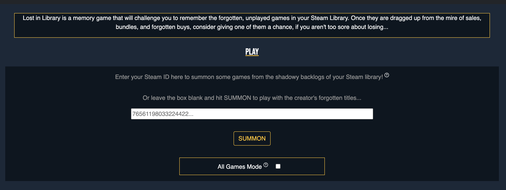

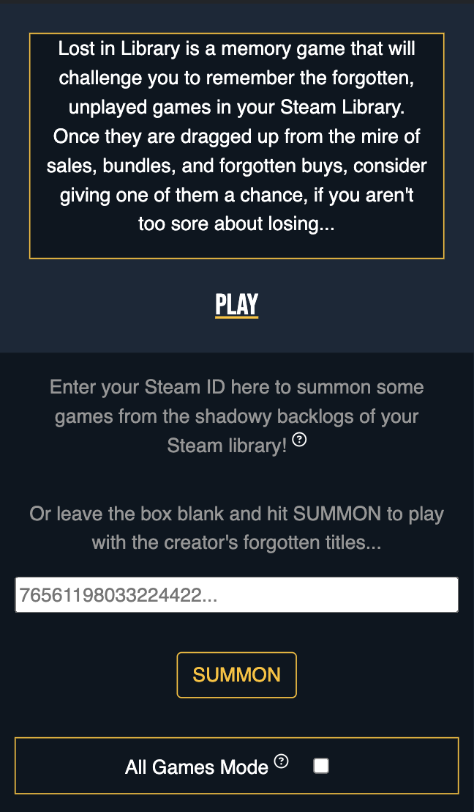

User stories: 1, 3, 4, 9, 11, 17

### Info modals

- Info modal with Help icon to explain what the Steam ID is for the user input and how it can be found
- Info modal with Help icon to explain what All Games Mode is and how it differs from the regular game

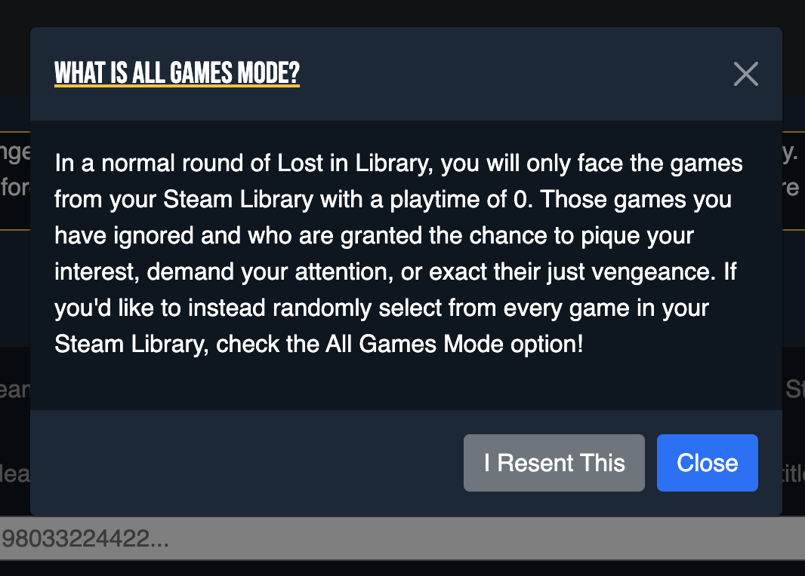

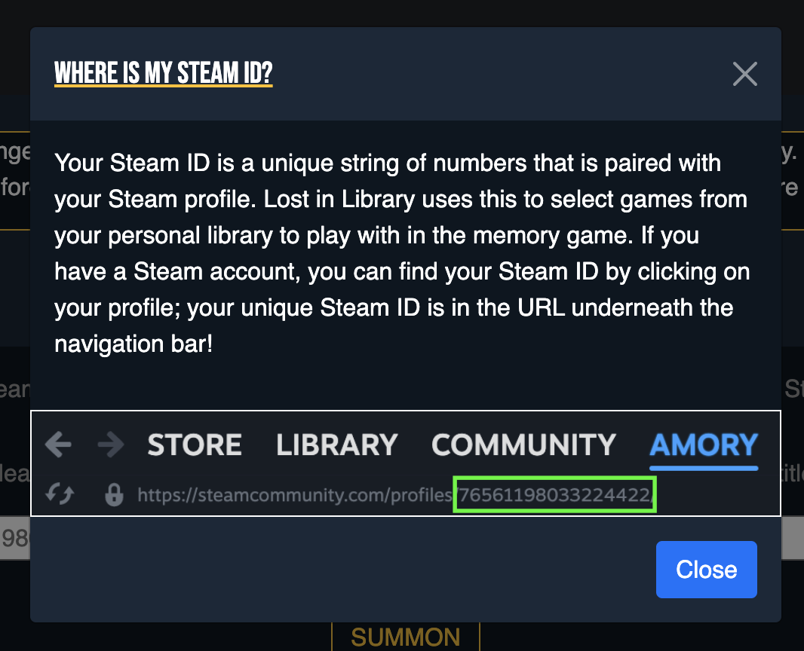

User stories: 2, 3, 4, 11

### Game board

- Clear separation of the section that displays the games and the section where the player makes their choices
- Simple visual design to focus on the gameplay elements
- Clear JavaScript functions to prevent incorrect player input and to ensure the games runs smoothly regardless of user error; player input is disabled whenever innappropriate, is clearly highlighted by animations that lighten the card on hover and change the background upon selection, and only allows for the correct sequence length
- A countdown timer to focus attention on the board before the sequence begins
- Window scrolls to the appropriate section for viewing the sequence and for making player selections, further informing and guiding user input
- Light up animation draws user attention to the Next Round button when it is activated and ready to start the next round
- Current Score section that is automatically updated after each round to show how far the game has progressed

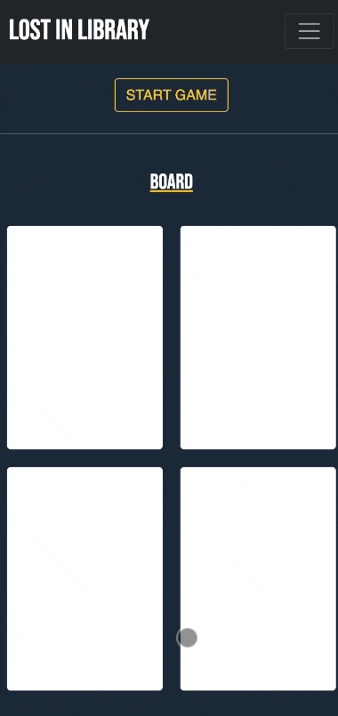

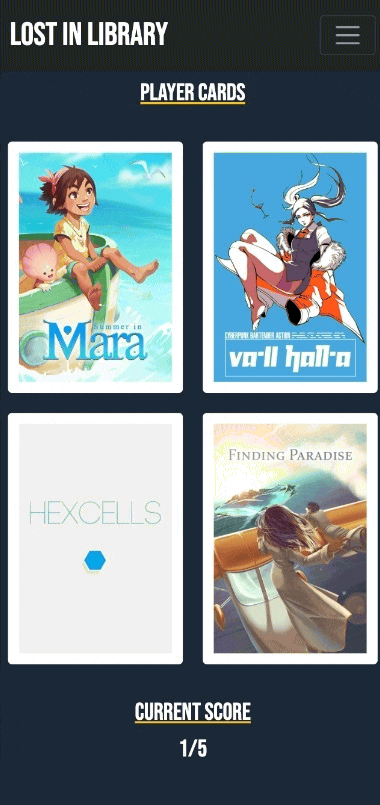

User stories: 4, 6, 9, 13, 16

### End Screen

- Customised end screen for player success and player failure
- Simple animations that play upon the end of the game
- On failure, automatically displays the next game they should have chosen in the sequence with cover art, title, and current total playtime
- On success, automatically displays the player's most played game with cover art, title, and current total playtime
- The most recent news item for the game displayed is listed beneath the game, providing a direct link to the Steam community page where the news is hosted
- A custom button to display the defeat or success modal message again once the player has clicked away
- A new game button that restarts the game ready to play again with new games

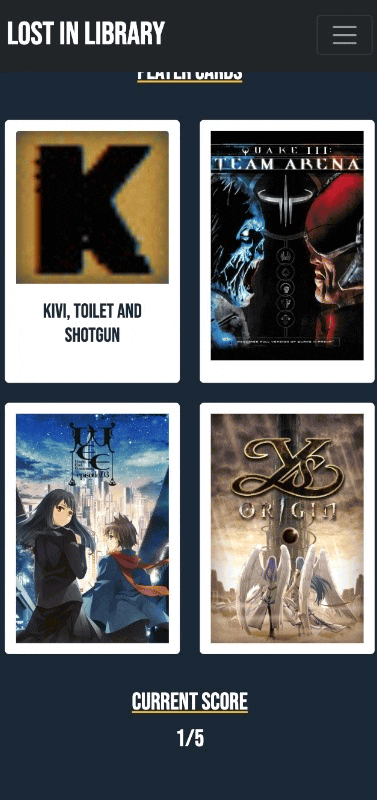

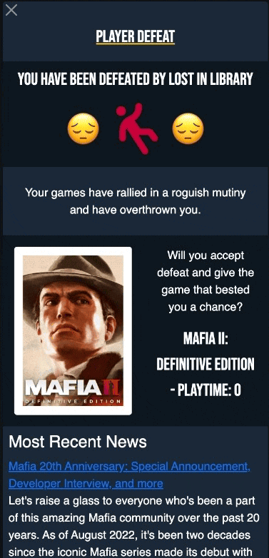

User stories: 6, 10, 12, 13, 14, 18

### Game information  

- Clear, easy-to-read description of the gameplay
- Direct and simple requirements list to play the game with user's own Steam account data

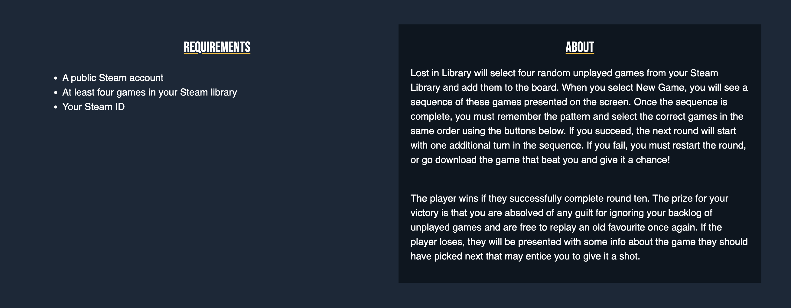

User stories: 1, 2, 3

### Privacy Policy

- Clear description of how the game works, how the game uses the Steam Web API, and how the data accessed is handled by the application
- Makes the relationship between the site and the service provided by Valve and Steam as clear as possible
- Linked at the bottom of each page of the website

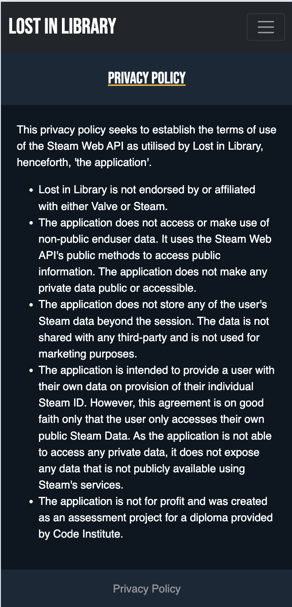

User stories: 5, 19

### Contact Form

- Simple contact form with clear labels and information, allowing the user to get in touch via email using EmailJS
- All fields validated

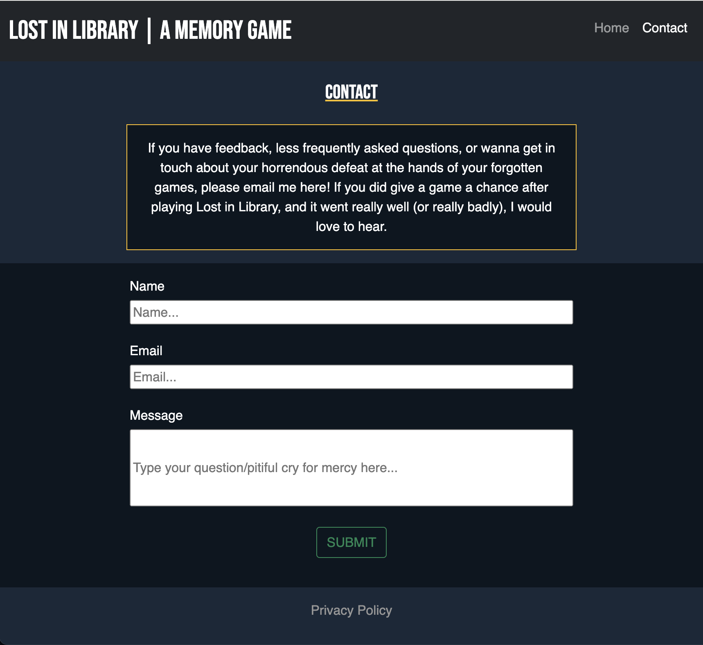

User stories: 7

### 404 Error

- Custom error page to allow the user to navigate back to the homepage or contact page without using browser buttons

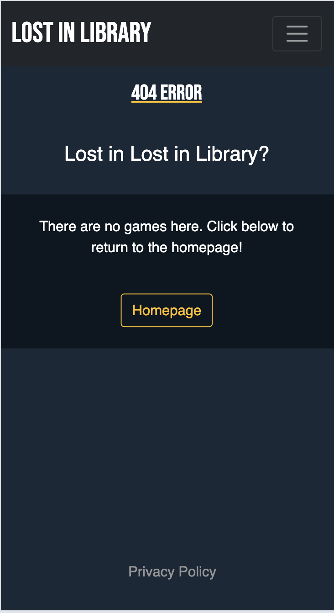

User stories: 8

## Testing

### HTML Validation

Validated with the W3C Markup Validation Service

[index.html](https://validator.w3.org/nu/?doc=https%3A%2F%2Flost-in-library-da89e4798031.herokuapp.com%2F)

The validator here lists several errors for the homepage that are related to elements being present on the page before they are populated with data provided by the Steam Web API. As part of the validation, I have checked each error listed and confirmed it is due to the game elements present and not yet visible on the page that will be transitioned to visible with the correct data and attributes once the game has begun. The error related to the presence of two 'main' elements on the page states that a document must not include more than one visible main element, which is the case at all times when using the site. The errors relating to the missing src and alt attributes are due to the img elements being present but not yet updated with those attributes by the functions that call the Steam Web API and populate the site with data. I am therefore confident to consider the page validated.

[contact.html](https://validator.w3.org/nu/?doc=https%3A%2F%2Flost-in-library-da89e4798031.herokuapp.com%2Fcontact.html)

No errors listed

[privacy.html](https://validator.w3.org/nu/?doc=https%3A%2F%2Flost-in-library-da89e4798031.herokuapp.com%2Fprivacy.html)

No errors listed

[404.html](https://validator.w3.org/nu/?doc=https%3A%2F%2Flost-in-library-da89e4798031.herokuapp.com%2F404.html)
No errors listed

### CSS Validation

Validated with the W3C CSS Validation Service

[index.html](https://jigsaw.w3.org/css-validator/validator?uri=https%3A%2F%2Flost-in-library-da89e4798031.herokuapp.com%2F&profile=css3svg&usermedium=all&warning=1&vextwarning=&lang=en)

No errors listed

### JavaScript Validation

setup.js - One warning listed for use of a for...of loop on line 107, which I have decided is the clearest and most efficient iteration to use.

game.js - One warning listed for use of a for loop on line 74, which I have again decided is the clearest and most efficient iteration to use.

email.js - Fifteen warnings listed, which all relate to JSLint not recognising the use of the jQuery '$' selector, and flagging the emailjs object as undeclared. I have decided no further revisions are necessary on these two matters.

### Accessibility

Validated with the WAVE Web Accessibility Evaluation Tools

All justified text was amended to left-aligned text to adhere to modern standards for better accessibility.

[index.html](https://wave.webaim.org/report#/https://lost-in-library-da89e4798031.herokuapp.com/index.html)

The accessibility tool lists nine errors on the homepage. As detailed in the HTML validation section, these are all due to empty img and heading elements that are all hidden on the page before the transition to the game screen, and which are all subsequently populated and labelled with the appropriate attributes. As these are nominal errors only, I have decided no further revisions are necessary.

[contact.html](https://wave.webaim.org/report#/https://lost-in-library-da89e4798031.herokuapp.com/contact.html)

No errors listed

[privacy.html](https://wave.webaim.org/report#/https://lost-in-library-da89e4798031.herokuapp.com/privacy.html)

No errors listed

[404.html](https://wave.webaim.org/report#/https://lost-in-library-da89e4798031.herokuapp.com/404.html)

No errors listed

### Performance

Performance testing by Google Lighthouse in Google Chrome Developer Tools

index.html
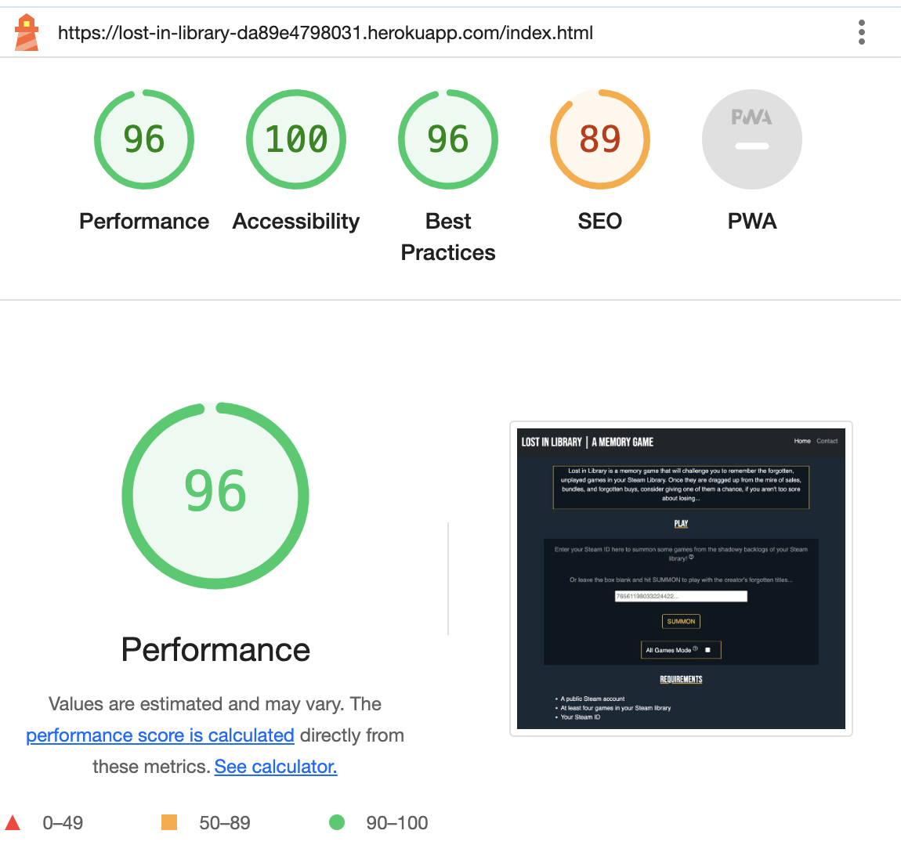

contact.html
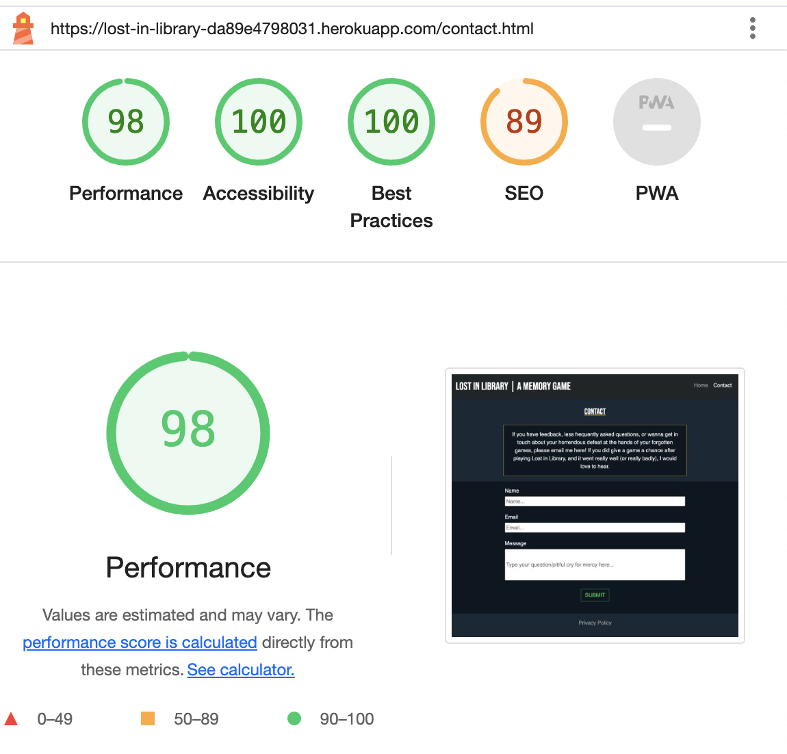

privacy.html
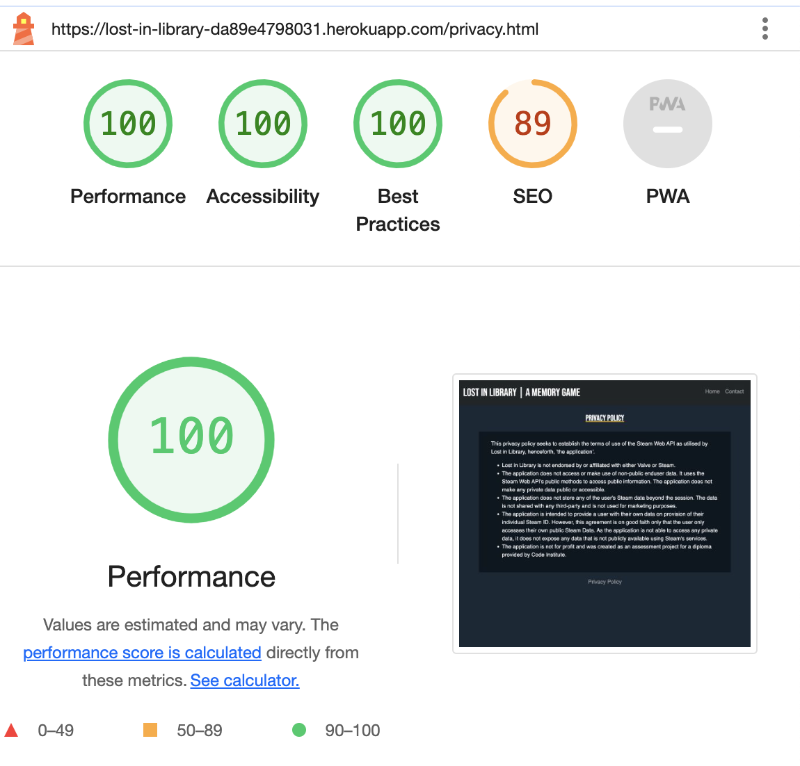

### Compatibility 

The website was tested and proved fully functional on the following devices;

- Macbook Pro
- Windows 10 PC
- iPhone 13

The website was tested and proved fully functional on the following browsers;

- Google Chrome
- Safari
- Firefox
- Opera
- Microsoft Edge

However, there is a minor bug in the desktop version of the Safari browser that causes the cover art images to stretch and extend the containers further than needed. I have added the -webkit-max-logical-height property to the CSS file to account somewhat for this bug, and this property minimises the additional extra padding on the card containers, though it is still noticeable. This does not affect the function of the website, only the visual design. 

Additionally, it has been tested on all device options using Google Chrome Developer Tools and proved responsive on all device sizes. 

### Testing User Stories

#### First-Time User

As a first-time user, I want to:

1. Understand what the site is offering and why at first glance

| **Feature** | **Action** | **Expected Result** | **Actual Result** |
| ---- | ---- | ---- | ---- |
| Landing Page | Open homepage | Presented with information on the game | Works as expected |
| Game Information | Scroll to info section on homepage | Presented with About and Requirements for the game | Works as expected |

Screen Capture

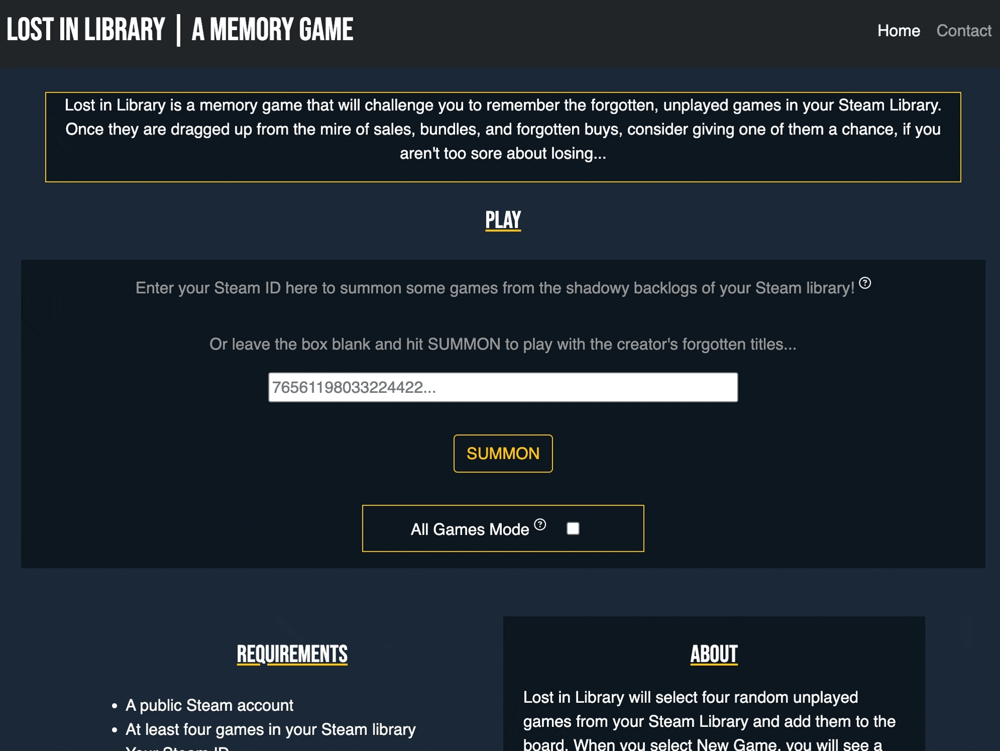

2. Grasp the rules of the game before starting to play

| **Feature** | **Action** | **Expected Result** | **Actual Result** |
| ---- | ---- | ---- | ---- |
| Info Modals | Click on Help icons | Modal opens with relevant explanation | Works as expected |
| Game Information | Scroll to info section on homepage | Presented with About and Requirements for the game | Works as expected |

Screen Capture

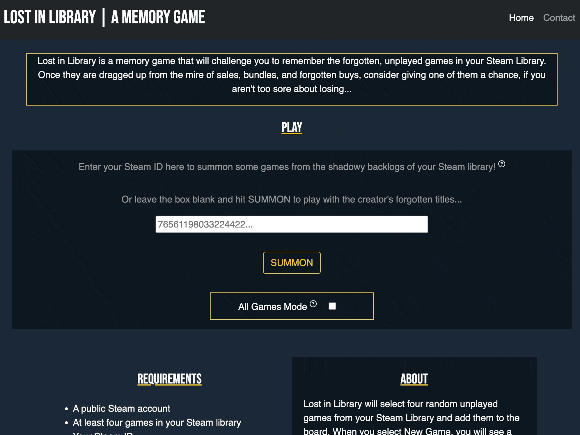

3. Be able to easily decide what parameters of the game I want to change

| **Feature** | **Action** | **Expected Result** | **Actual Result** |
| ---- | ---- | ---- | ---- |
| Landing Page | Open homepage | Presented with information on the game | Works as expected |
| Info Modals | Click on Help icons | Modal opens with relevant explanation | Works as expected |
| Game Information | Scroll to info section on homepage | Presented with About and Requirements for the game | Works as expected |

Screen Capture

4. Still be able to play the game if I am not a Steam user or am not seeking a personalised game experience

| **Feature** | **Action** | **Expected Result** | **Actual Result** |
| ---- | ---- | ---- | ---- |
| Landing Page | Open homepage | Presented with information on the game | Works as expected |
| Info Modals | Click on Help icons | Modal opens with relevant explanation | Works as expected |
| Game Board | Start a new game | Page transitions to the game board state, ready to play | Works as expected |

Screen Capture

5. Know how the game works and how it is processing my personal data

| **Feature** | **Action** | **Expected Result** | **Actual Result** |
| ---- | ---- | ---- | ---- |
| Privacy Policy | Click on Privacy Policy link at the bottom of any page | Loads privacy policy | Works as expected |

Screen Capture

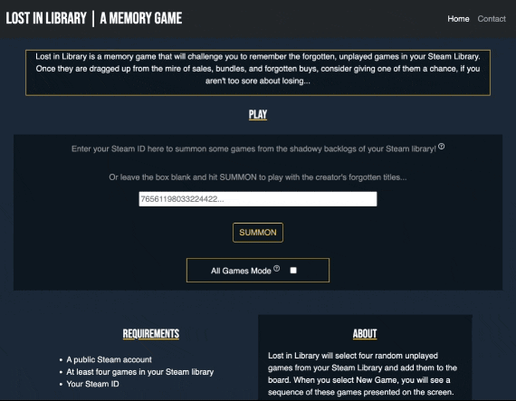

6. Play on whatever device I am using

| **Feature** | **Action** | **Expected Result** | **Actual Result** |
| ---- | ---- | ---- | ---- |
| Game Board | Start a new game | Page transitions to the game board state, ready to play | Works as expected |
| End Screen | Make the final selection of any game | End screen modal opens with defeat or success message | Works as expected |

Screen Capture

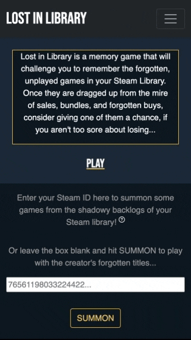

7. Easily contact the creator of the site if I have questions or feedback

| **Feature** | **Action** | **Expected Result** | **Actual Result** |
| ---- | ---- | ---- | ---- |
| Contact Form | Click on Contact page link in navbar of any page | Opens a functional contact form with info and labels | Works as expected |

Screen Capture

#### Returning User
As a returning user, I want to:

8. Navigate around the site with ease and clarity

| **Feature** | **Action** | **Expected Result** | **Actual Result** |
| ---- | ---- | ---- | ---- |
| Header and Navigation | Click on page links in navbar from any page | Website navigates to the correct page | Works as expected |
| 404 Page | Navigate to a page that doesn't exist | Custom 404 page loads redirecting user to homepage | Works as expected |

Screen Capture

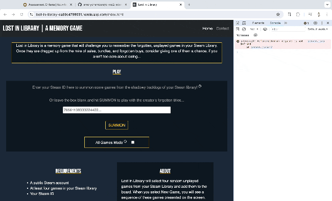

9. Start the game quickly, as I already understand the rules

| **Feature** | **Action** | **Expected Result** | **Actual Result** |
| ---- | ---- | ---- | ---- |
| Landing Page | Open homepage | Presented with information on the game | Works as expected |
| Game Board | Start a new game | Page transitions to the game board state, ready to play | Works as expected |

Screen Capture

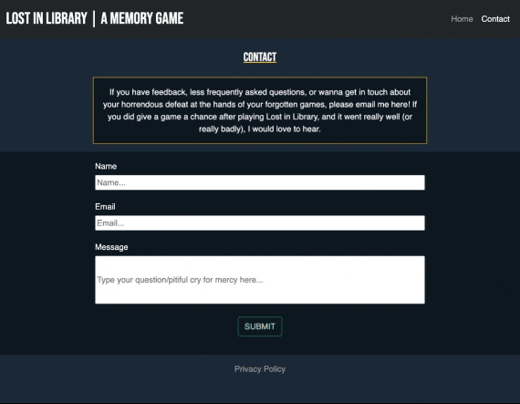

10. Start a new game when the first game is finished

| **Feature** | **Action** | **Expected Result** | **Actual Result** |
| ---- | ---- | ---- | ---- |
| End Screen | Make the final selection of any game | End screen offers custom New Game button to restart | Works as expected |

Screen Capture

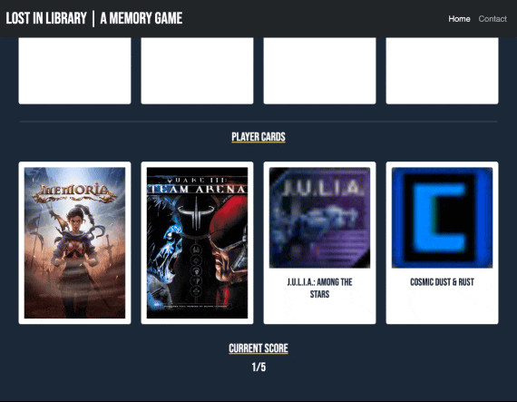

11. Choose how I want to play the game

| **Feature** | **Action** | **Expected Result** | **Actual Result** |
| ---- | ---- | ---- | ---- |
| Landing Page | Open homepage | Presented with information on the game | Works as expected |
| Info Modals | Click on Help icons | Modal opens with relevant explanation | Works as expected |

Screen Capture

12. Have a new experience each time I play

| **Feature** | **Action** | **Expected Result** | **Actual Result** |
| ---- | ---- | ---- | ---- |
| Game Board | Start a new game | A new selection of games each time you play a new game | Works as expected |
| End Screen | Make the final selection of any game | New Game button selects different games and restarts | Works as expected |

Screen Capture

13. Be surprised by games in my game library that I haven't played

| **Feature** | **Action** | **Expected Result** | **Actual Result** |
| ---- | ---- | ---- | ---- |
| Game Board | Start a new game | The game selects unplayed games only by default | Works as expected |
| End Screen | Make the final selection of any game | On failure end screen displays game info and playtime | Works as expected |

Screen Capture

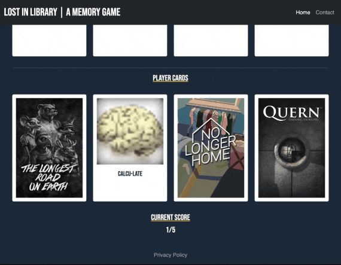

14. Be able to easily check out one of those games at the end of the memory game

| **Feature** | **Action** | **Expected Result** | **Actual Result** |
| ---- | ---- | ---- | ---- |
| End Screen | Make the final selection of any game | End screen displays most recent news item from Steam with a convenient link | Works as expected |

Screen Capture

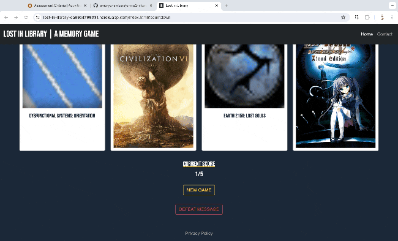

#### Site Owner
As the site owner, I want to:

15. Create an accessible and responsive website that works well and looks good on a wide range of devices

| **Feature** | **Action** | **Expected Result** | **Actual Result** |
| ---- | ---- | ---- | ---- |
| Header and Navigation | Click on page links in navbar from any page | Website navigates to the correct page | Works as expected |

Screen Capture

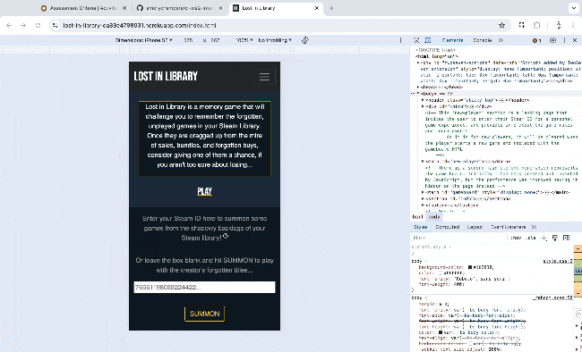

16. Design a fun, simple memory game

| **Feature** | **Action** | **Expected Result** | **Actual Result** |
| ---- | ---- | ---- | ---- |
| Game Board | Start a new game | Game focuses on board, plays countdown, and displays first sequence on starting round | Works as expected |

Screen Capture

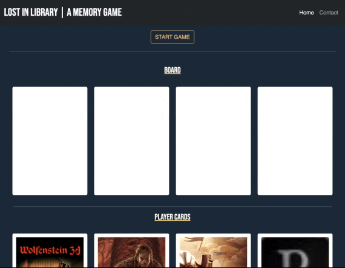

17. Tailor the game and website experience to the target demographic

| **Feature** | **Action** | **Expected Result** | **Actual Result** |
| ---- | ---- | ---- | ---- |
| Landing Page | Open homepage | Presented with information on the game | Works as expected |

Screen Capture

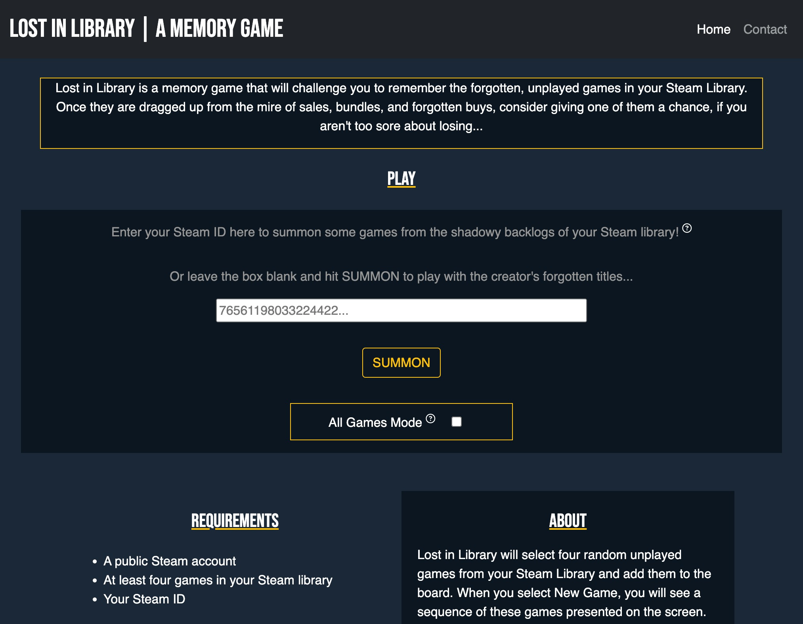

18. Encourage users to have fun, and to explore their unplayed games

| **Feature** | **Action** | **Expected Result** | **Actual Result** |
| ---- | ---- | ---- | ---- |
| End Screen | Make the final selection of any game | End screen displays most recent news item from Steam with a convenient link | Works as expected |

Screen Capture

19. Aim for as simple an experience as possible and be direct about how the game accesses and uses personal data

| **Feature** | **Action** | **Expected Result** | **Actual Result** |
| ---- | ---- | ---- | ---- |
| Privacy Policy | Click on Privacy Policy link at the bottom of any page | Loads privacy policy | Works as expected |

Screen Capture

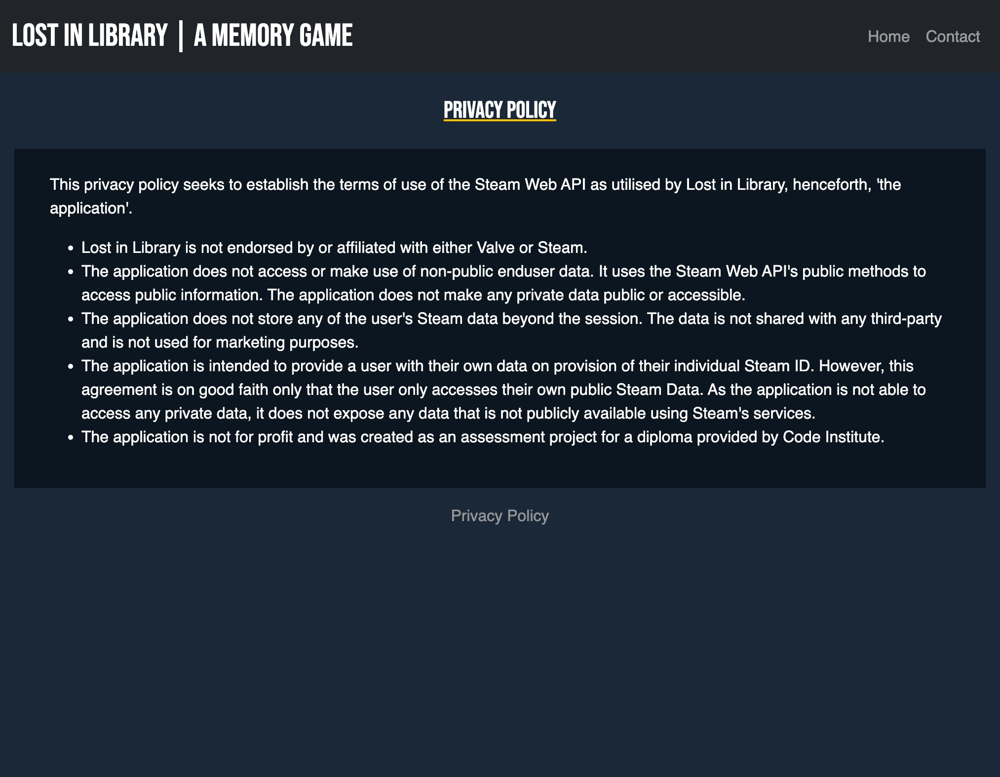

## Bugs

## Credits

- [Dan Beyer's](https://danbeyer.github.io/) useful guide on creating server side HTTP calls to the Steam Web API
- [twilio.com](https://www.twilio.com/docs/usage/tutorials/how-to-set-up-your-node-js-and-express-development-environment) guide on creating an Express.js application 
- [jestjs.io](https://jestjs.io/docs/) 
- Stackoverflow user Shog9 for the [suggestion to use :first-child selector in jQuery when looping over array](https://stackoverflow.com/questions/2275702/jquery-first-child-of-this)
- Stackoverflow user Pointy for highlighting the issue with a for loop I wrote with setTimeout functions, relating to [using separate instances of the index 'i'](https://stackoverflow.com/questions/5226285/settimeout-in-for-loop-does-not-print-consecutive-values)

### External Code

- Initial template with .devcontainer folder cloned from Code Institute [ci-full-template](https://github.com/Code-Institute-Org/ci-full-template)
- Initial boilerplate HTML head from [Emmet extension](https://emmet.io/) in Visual Studio Code
- Code snippet for navigation bar from [Bootstrap v5.3 documentation](https://getbootstrap.com/docs/5.3/components/navbar/)
- Common syntax for XMLHttpRequest in JavaScript from [W3Schools](https://www.w3schools.com/xml/xml_http.asp)
- Server code snippet for creating server side HTTP calls to the Steam Web API from [Dan Beyer](https://danbeyer.github.io/steamapi/page2.html)

## Deployment

The website is deployed on Heroku.

To fork the repository:

1. Navigate to the Github repository [here](https://github.com/amorychambers/ci-ms2-interactivity)
2. Click on the 'Fork' option towards the top of the page

To deploy on Heroku:

1. Navigate to your [Heroku Dashboard](https://dashboard.heroku.com/apps)
2. Select the 'New' button in the top right hand side of the screen, and select 'Create New App'
3. Give the new application a name of your choosing and select your region
4. Click the 'Create App button'
5. Select the 'GitHub' option in the Deployment Method section
6. Sign in with Github
7. Search for your forked repository and select it once located
8. Choose automatic or manual deploys
    1. For automatic deploys, choose the main branch and select Enable Automatic Deloys
    2. For manual deploys, choose the main branch and select Deploy Branch

## Acknowledgements